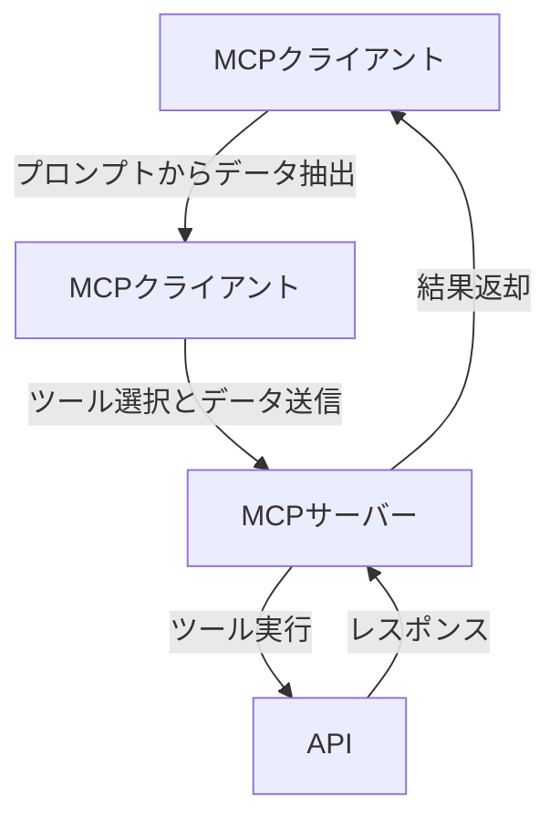
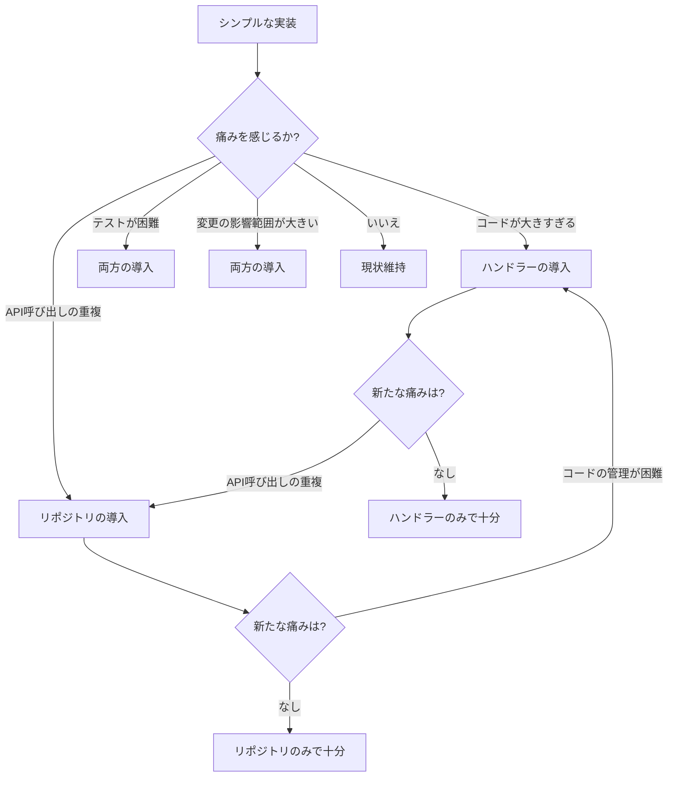

## はじめに

※この記事は、kintone向けのMCPサーバーの設計を詳しく理解するにあたって、下記のGithubリポジトリの実装をもとに学ばせていただいた内容を整理・生成したものです。実際の実装から帰納的に無理やり体系化しているので、本来の"アーキテクチャ"を中したしたコンテクストからは若干偏っています。ご了承ください。

https://github.com/r3-yamauchi/kintone-mcp-server


---
前回の記事（[備忘録：MCPサーバーの設計におけるハンドラーとリポジトリパターン：レストランに例えるMCPサーバーの設計](https://qiita.com/moduloseal/items/5cea6bf5553b32776f36)）では、ハンドラーとリポジトリパターンの基本概念と利点について、レストランを例に解説しました。しかし、「そもそもいつこれらのパターンを採用すべきなのか？」という疑問が残ったかもしれません。

とっかかりとして、MCPサーバーのシンプルな実装例を下記に示します：



この記事では、上記なシンプルな実装例をもとに、より洗練されたハンドラーとリポジトリパターンの採用に至る「きっかけ」について解説します。

## 1. シンプルな実装から始まる旅

最初のMCPサーバー実装は、多くの場合シンプルなものから始まります：

```javascript
// シンプルなMCPサーバーの実装例：toolsの処理例を示しています
function handleToolRequest(request) {
  const { name, args } = request.params;
  
  if (name === 'get_record') {
    return fetchRecord(args.app_id, args.record_id);
  } 
  else if (name === 'search_records') {
    return searchRecords(args.app_id, args.query);
  }
  else if (name === 'create_record') {
    return createRecord(args.app_id, args.fields);
  }
  // 他のツール...
}

async function fetchRecord(appId, recordId) {
  const response = await fetch(`https://${domain}/k/v1/record.json?app=${appId}&id=${recordId}`);
  return response.json();
}
```

このシンプルな実装でも、基本的な機能は動作します。では、なぜより複雑なパターンが必要になるのでしょうか？

## 2. 複雑さが増す瞬間（発想の起点）

ハンドラーやリポジトリが必要になる「発想の起点」は、以下のような具体的な問いや状況に直面したときです：

### 2.1 ツールの数が増えたとき

**具体的な問い**：
「10種類以上のツールを追加する必要があるが、すべてを1つのファイルに書くと管理が難しくなるのではないか？」

```javascript
// 単一ファイルでの実装例（複雑化の始まり）
function handleToolRequest(name, args) {
  if (name === 'get_record') {
    // レコード取得の処理...
  } 
  else if (name === 'search_records') {
    // レコード検索の処理...
  }
  else if (name === 'create_record') {
    // レコード作成の処理...
  }
  // さらに20種類のツールが続く...
}
```

このコードが数百行に膨れ上がると、保守が困難になります。

### 2.2 同じAPIを複数の場所で呼び出すとき

**具体的な問い**：
「レコード取得のAPIを複数のツールから呼び出しているが、APIの仕様が変わったら全箇所を修正する必要があるのか？」

```javascript
// 重複するAPI呼び出し（問題の兆候）
function getRecordTool(args) {
  // kintone APIを直接呼び出す
  return fetch(`https://${domain}/k/v1/record.json?app=${args.app_id}&id=${args.record_id}`);
}

function updateRecordTool(args) {
  // 更新前に同じAPIを呼び出して現在の値を取得
  return fetch(`https://${domain}/k/v1/record.json?app=${args.app_id}&id=${args.record_id}`)
    .then(record => {
      // 更新処理...
    });
}
```

### 2.3 エラー処理が複雑になるとき

**具体的な問い**：
「各ツールで似たようなエラー処理を書いているが、共通化できないか？」

```javascript
// 重複するエラー処理（問題の兆候）
function getRecordTool(args) {
  try {
    // 処理...
  } catch (error) {
    if (error.code === 'GAIA_RE01') {
      return { error: 'レコードが見つかりません' };
    } else if (error.code === 'GAIA_AP01') {
      return { error: 'アプリが見つかりません' };
    }
    // その他多数のエラーケース...
  }
}

function updateRecordTool(args) {
  try {
    // 処理...
  } catch (error) {
    // 同じようなエラー処理の繰り返し...
  }
}
```

### 2.4 テストが困難になるとき

**具体的な問い**：
「APIを実際に呼び出さずにツールのロジックだけをテストする方法はないか？」

直接APIを呼び出すコードはテストが難しくなります。

## 3. 設計改善の具体的なきっかけ

以下のような具体的な状況が、ハンドラーやリポジトリパターンの採用を促します：

### 3.1 コードの肥大化

**きっかけとなる状況**：
```
index.js: 2000行を超えた
```

**自問自答**：
「このファイルが大きすぎて理解しづらい。機能ごとに分割できないか？」

### 3.2 機能追加の困難さ

**きっかけとなる状況**：
```
// 新機能追加のために既存コードを大幅に修正する必要がある
function handleToolRequest(name, args) {
  // 既存の100行のif-elseチェーンに新しい条件を追加
}
```

**自問自答**：
「新機能を追加するたびに、このメイン関数を修正するのはリスクが高いのでは？」

### 3.3 重複コードの増加

**きっかけとなる状況**：
```
// 同じようなAPIコールが複数箇所に存在
const response1 = await fetch(`https://${domain}/k/v1/record.json?app=${appId}&id=${recordId}`);
// 別の場所で
const response2 = await fetch(`https://${domain}/k/v1/record.json?app=${appId}&id=${recordId}`);
```

**自問自答**：
「同じAPIコールを何度も書いているが、これは共通化できないか？」

### 3.4 テスト作成の困難さ

**きっかけとなる状況**：
```
// テスト作成が困難なコード
async function testGetRecordTool() {
  // 実際のAPIを呼び出すため、テスト環境の構築が複雑
}
```

**自問自答**：
「APIとの通信部分を分離できれば、モックを使ってテストが簡単になるのでは？」

## 4. 具体的な設計改善の道筋

シンプルな実装から、ハンドラーとリポジトリを導入する具体的な道筋を見てみましょう：

### ステップ1: 機能ごとのファイル分割（ハンドラーの萌芽）

```javascript
// 最初の改善: 機能ごとにファイルを分割
// record-tools.js
export function getRecord(args) { /* ... */ }
export function searchRecords(args) { /* ... */ }

// app-tools.js
export function getAppsInfo(args) { /* ... */ }

// server.js
import * as recordTools from './record-tools.js';
import * as appTools from './app-tools.js';

function handleToolRequest(name, args) {
  if (name === 'get_record') return recordTools.getRecord(args);
  if (name === 'search_records') return recordTools.searchRecords(args);
  if (name === 'get_apps_info') return appTools.getAppsInfo(args);
  // ...
}
```

### ステップ2: API呼び出しの共通化（リポジトリの萌芽）

```javascript
// API呼び出しを共通化
// kintone-api.js
export async function getRecord(appId, recordId) {
  const response = await fetch(`https://${domain}/k/v1/record.json?app=${appId}&id=${recordId}`);
  return response.json();
}

// record-tools.js
import * as kintoneApi from './kintone-api.js';

export async function getRecord(args) {
  return kintoneApi.getRecord(args.app_id, args.record_id);
}
```

### ステップ3: ハンドラーパターンの導入

```javascript
// ハンドラーパターンの導入
// tool-handlers.js
export function handleRecordTools(name, args, api) {
  if (name === 'get_record') return getRecord(args, api);
  if (name === 'search_records') return searchRecords(args, api);
  // ...
}

function getRecord(args, api) {
  return api.getRecord(args.app_id, args.record_id);
}

// server.js
import { handleRecordTools } from './tool-handlers.js';
import * as kintoneApi from './kintone-api.js';

function executeToolRequest(request) {
  const { name, args } = request;
  
  if (['get_record', 'search_records'].includes(name)) {
    return handleRecordTools(name, args, kintoneApi);
  }
  // ...
}
```

### ステップ4: リポジトリパターンの導入

```javascript
// リポジトリパターンの導入
// kintone-repository.js
export class KintoneRepository {
  constructor(credentials) {
    this.domain = credentials.domain;
    // ...
  }
  
  async getRecord(appId, recordId) {
    const response = await fetch(`https://${this.domain}/k/v1/record.json?app=${appId}&id=${recordId}`);
    return response.json();
  }
  
  // その他のAPI呼び出し...
}

// server.js
import { KintoneRepository } from './kintone-repository.js';
import { handleRecordTools } from './tool-handlers.js';

const repository = new KintoneRepository(credentials);

function executeToolRequest(request) {
  const { name, args } = request;
  
  if (['get_record', 'search_records'].includes(name)) {
    return handleRecordTools(name, args, repository);
  }
  // ...
}
```

## 5. 判断の基準となる具体的な問い

ハンドラーやリポジトリが必要かどうかを判断するための具体的な問いをまとめます：

### 5.1 ハンドラーが必要かどうかの問いの具体例

1. **コードの量**: 「1つのファイルが500行を超えていないか？」
2. **機能の分類**: 「似たような機能をグループ化できないか？」
3. **変更の頻度**: 「特定の機能だけを頻繁に変更する必要があるか？」
4. **責任の分離**: 「このコードは複数の責任を持っていないか？」
5. **拡張性**: 「新しい機能を追加するたびに既存コードを修正する必要があるか？」

### 5.2 リポジトリが必要かどうかの問いのぐたいれい

1. **API呼び出しの重複**: 「同じAPIを複数の場所から呼び出していないか？」
2. **データアクセスの複雑さ**: 「データの取得・保存ロジックが複雑になっていないか？」
3. **テスト容易性**: 「APIを実際に呼び出さずにテストしたいと思わないか？」
4. **依存関係**: 「APIの詳細がコードの多くの部分に漏れていないか？」
5. **データ変換**: 「APIから取得したデータを使いやすい形に変換する処理が重複していないか？」

## 6. 実際の判断例

実際のプロジェクトでどのように判断するかの例を見てみましょう：

### 例1: シンプルなMCPサーバー（ハンドラー/リポジトリ不要）

**状況**:
- ツールは3種類のみ
- 各ツールは独立した単純な処理
- APIの呼び出しは各ツールで1回ずつ

**判断**:
「ツールの数が少なく、処理も単純なので、シンプルな実装で十分」

```javascript
// シンプルな実装で十分な例
function handleToolRequest(request) {
  const { name, args } = request;
  
  if (name === 'get_data') {
    return fetchData(args.id);
  } else if (name === 'update_data') {
    return updateData(args.id, args.data);
  } else if (name === 'delete_data') {
    return deleteData(args.id);
  }
}
```

### 例2: 中規模のMCPサーバー（ハンドラーは必要、リポジトリは不要）

**状況**:
- ツールは10種類程度
- 機能的に分類可能（データ操作、ファイル操作など）
- APIの呼び出しはシンプルで重複が少ない

**判断**:
「ツールの数が増えてきたので、機能ごとにハンドラーに分けるべき。ただし、API呼び出しはシンプルなのでリポジトリまでは不要」

```javascript
// ハンドラーは導入するが、リポジトリは不要な例
import { handleDataTools } from './data-tools.js';
import { handleFileTools } from './file-tools.js';

function executeToolRequest(request) {
  const { name, args } = request;
  
  if (['get_data', 'update_data'].includes(name)) {
    return handleDataTools(name, args);
  } else if (['upload_file', 'download_file'].includes(name)) {
    return handleFileTools(name, args);
  }
}
```

### 例3: 大規模なMCPサーバー（ハンドラーとリポジトリが必要）

**状況**:
- ツールは30種類以上
- 複数のツールが同じAPIを呼び出す
- データ変換ロジックが複雑
- テストの必要性が高い

**判断**:
「ツールの数が多く、API呼び出しの重複も多いため、ハンドラーとリポジトリの両方が必要」

```javascript
// ハンドラーとリポジトリの両方を導入する例
import { Repository } from './repository.js';
import { handleDataTools, handleFileTools } from './handlers/index.js';

const repository = new Repository(config);

function executeToolRequest(request) {
  const { name, args } = request;
  
  try {
    if (['get_data', 'update_data'].includes(name)) {
      return handleDataTools(name, args, repository);
    } else if (['upload_file', 'download_file'].includes(name)) {
      return handleFileTools(name, args, repository);
    }
  } catch (error) {
    return handleError(error);
  }
}
```

## 7. 「痛み」を感じたときが導入のタイミング

ハンドラーやリポジトリが必要になる発想の起点は、以下のような「痛み」を感じたときです：



1. **コードの肥大化の痛み**：「このファイルが大きすぎて理解できない」
2. **変更の困難さの痛み**：「小さな変更なのに、影響範囲が大きい」
3. **重複コードの痛み**：「同じようなコードを何度も書いている」
4. **テストの困難さの痛み**：「このコードをテストするのが難しい」

## 8. まとめ：段階的な改善アプローチ

ハンドラーとリポジトリパターンの導入は、一度に行う必要はありません。プロジェクトの成長に合わせて段階的に導入することが実践的です：

1. **小規模プロジェクト**：シンプルな実装で始める
2. **成長期**：痛みを感じ始めたら、ハンドラーやリポジトリの導入を検討
3. **大規模プロジェクト**：両方のパターンを活用して保守性と拡張性を確保

最も重要なのは、「過剰設計」を避けることです。必要性を感じる前に複雑なパターンを導入すると、かえって開発効率が下がる可能性があります。

自分のプロジェクトで「この痛みを感じるか？」と問いかけることが、適切な設計判断への第一歩です。最初からすべてを完璧に設計する必要はなく、必要に応じて段階的に改善していくアプローチが実践的です。

## おわりに

ハンドラーとリポジトリパターンは、コードの肥大化や複雑さが増したときに真価を発揮します。これらのパターンを導入するタイミングを見極めることで、過剰設計を避けつつ、保守性と拡張性の高いコードベースを構築することができます。

前回の記事で説明したレストランの例に戻ると、小さな家族経営のカフェでは、オーナーが注文も調理も配膳も一人でこなすかもしれません。しかし、お店が大きくなり、メニューが増え、お客様が増えるにつれて、役割分担が必要になってきます。それと同じように、プロジェクトの規模と複雑さに応じて、適切な設計パターンを選択することが重要です。 
