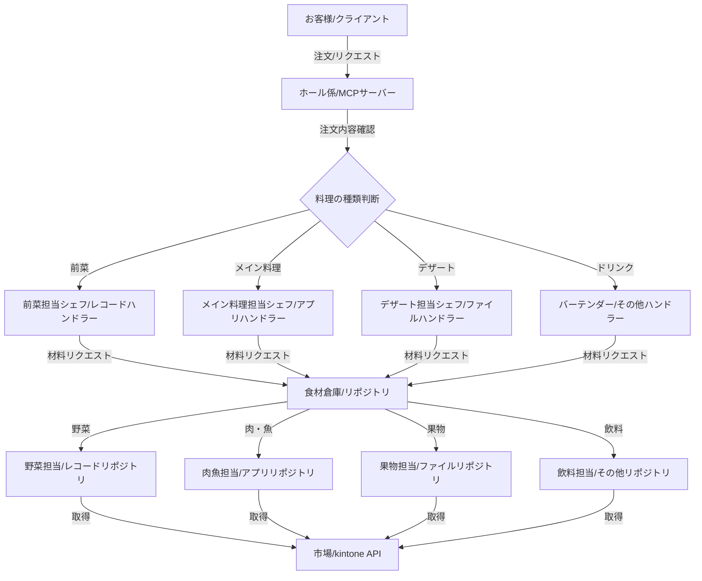

### ※注釈

※この記事は、MCPサーバーの設計を詳しく理解するにあたって、下記のGithubリポジトリの実装をもとに学ばせていただいた内容を整理・生成したものです。実際の実装から機能的に無理やり体系化しているので、本来の"アーキテクチャ"を中したしたコンテクストからは若干偏っている(サービス層とかにはいっさい触れてなかったり…など)と思われます。ご了承ください。

https://github.com/r3-yamauchi/kintone-mcp-server

## はじめに

ソフトウェア設計において、「ハンドラー」と「リポジトリ」というパターンをよく目にします。特にModel Context Protocol（MCP）のようなサーバー実装では、これらのパターンが重要な役割を果たしています。しかし、これらの概念は初めて触れる方には少し抽象的に感じるかもしれません。

## ハンドラーとリポジトリの本質

ハンドラーとリポジトリの本質について簡潔に説明します。

### ハンドラーの本質
ハンドラーの本質は「**特定の種類のリクエストや処理を専門的に扱う責任者**」です。

- ハンドラーは特定の機能領域（例：レコード操作、ファイル操作）を担当し、その処理に関するビジネスロジックを集約します
- 「何をするか」を知っており、特定のドメインに関する処理を専門的に実行します
- 責任の分離と専門性に基づいて設計されています

### リポジトリの本質
リポジトリの本質は「**データアクセスを抽象化し、一貫した方法でデータの取得・保存を提供する層**」です。

- データソース（API、データベースなど）へのアクセス方法を抽象化し、一貫したインターフェースを提供します
- 「どうやってデータを取得・保存するか」を知っており、データアクセスの詳細を隠蔽します
- ビジネスロジック層（ハンドラー）がデータソースの詳細を知らなくても良いようにします

### 両者の関係
ハンドラーとリポジトリの関係は以下のようになります：

1. ハンドラーは「何をするか」を知っている（ビジネスロジック）
2. リポジトリは「どうやってデータを取得・保存するか」を知っている（データアクセス）
3. ハンドラーはリポジトリを使ってデータを取得・保存し、そのデータを加工して結果を返す

この分離により、ビジネスロジックとデータアクセスの責任が明確に分かれ、それぞれを独立して変更・テストできるようになります。

## 🍽️ レストランに例えるMCPサーバー

ハンドラーとリポジトリの役割を「レストラン」という身近な例に例えて説明し、その利点を分かりやすく解説します。

### 全体像

MCPサーバーをレストランに例えると、以下のような対応関係になります：

## 1. 各役割の対応関係

### 1.1 基本的な対応関係

| MCPサーバーの要素 | レストランの要素 | 役割 |
|-----------------|----------------|------|
| クライアント | お客様 | サービスを利用する |
| MCPサーバー | レストラン全体 | サービスを提供する |
| リクエストハンドラー | ホール係（ウェイター） | 注文を受け、適切な担当に振り分ける |
| ツールハンドラー | 料理担当シェフ | 特定の種類の料理（機能）を担当する |
| リポジトリ | 食材倉庫管理者 | 必要な材料（データ）を提供する |
| 専門リポジトリ | 食材カテゴリ担当 | 特定の種類の材料を専門的に管理する |
| kintone API | 市場・仕入れ先 | 実際のデータ（食材）の供給源 |

### 1.2 具体的なツールとハンドラーの対応

| MCPのツール/ハンドラー | レストランの料理/担当 |
|----------------------|-------------------|
| RecordTools（レコード操作） | 前菜担当シェフ |
| AppTools（アプリ操作） | メイン料理担当シェフ |
| FileTools（ファイル操作） | デザート担当シェフ |
| SpaceTools（スペース操作） | サイドメニュー担当シェフ |
| UserTools（ユーザー操作） | ドリンク担当バーテンダー |

## 2. 処理の流れをレストランの例で説明

### 2.1 お客様の注文からお料理提供まで（リクエスト処理の流れ）

1. **お客様（クライアント）が注文する**
   - お客様：「前菜のカルパッチョをお願いします」
   - （クライアントが「get_record」ツールを実行するリクエストを送信）

2. **ホール係（リクエストハンドラー）が注文を受ける**
   - ホール係：「カルパッチョですね、承りました」
   - （MCPサーバーがリクエストを受け取り、CallToolRequestSchemaハンドラーが起動）

3. **ホール係が注文内容を確認し、適切な担当シェフに伝える**
   - ホール係：「前菜担当、カルパッチョの注文です」
   - （executeToolRequest関数がリクエストを分析し、handleRecordToolsを呼び出す）

4. **前菜担当シェフ（RecordToolsハンドラー）が注文を受け取る**
   - 前菜担当：「カルパッチョですね、必要な材料を確認します」
   - （handleRecordTools関数が「get_record」の処理を開始）

5. **シェフが食材倉庫管理者（リポジトリ）に材料を依頼**
   - 前菜担当：「鮮魚と野菜が必要です」
   - （handleRecordTools関数がrepository.getRecordを呼び出す）

6. **倉庫管理者が専門の担当者に依頼**
   - 倉庫管理者：「魚担当、今日の鮮魚をお願い。野菜担当、新鮮な野菜も」
   - （KintoneRepositoryがKintoneRecordRepositoryに処理を委譲）

7. **専門担当者が市場（API）から材料を調達**
   - 魚担当：「市場から最高の鮮魚を仕入れてきました」
   - （KintoneRecordRepositoryがkintone APIを呼び出してデータを取得）

8. **材料が順次シェフに届けられる**
   - 倉庫→シェフ：「ご注文の材料です」
   - （APIからのレスポンスがリポジトリを通じてハンドラーに戻る）

9. **シェフが料理を作る**
   - 前菜担当：「材料を使ってカルパッチョを作ります」
   - （ハンドラーがデータを加工・整形）

10. **完成した料理がホール係に渡される**
    - 前菜担当→ホール係：「カルパッチョの完成です」
    - （ハンドラーの結果がexecuteToolRequestに戻る）

11. **ホール係がお客様に料理を提供**
    - ホール係→お客様：「お待たせしました、カルパッチョです」
    - （MCPサーバーがクライアントにレスポンスを返す）

### 2.2 エラーが発生した場合（エラーハンドリング）

1. **材料が足りない場合**
   - 魚担当：「申し訳ありません、今日は鮮魚の入荷がありませんでした」
   - （kintone APIからエラーレスポンスが返る）

2. **シェフがホール係に報告**
   - 前菜担当→ホール係：「材料不足でカルパッチョを作れません」
   - （ハンドラーがエラーをスローし、executeToolRequestのcatchブロックで捕捉）

3. **ホール係がお客様に丁寧に説明**
   - ホール係→お客様：「申し訳ございません。鮮魚の入荷がなく、カルパッチョをご提供できません。代わりにこちらのメニューはいかがでしょうか？」
   - （handleToolError関数が詳細なエラーメッセージと対応策を生成し、クライアントに返す）

## 3. ハンドラーとリポジトリの特徴を例で理解する

### 3.1 ハンドラーの特徴（シェフの役割）

1. **専門性**：
   - レストラン例：前菜担当シェフは前菜の作り方を熟知しているが、デザートの作り方は知らない
   - MCPサーバー：RecordToolsハンドラーはレコード操作に特化し、ファイル操作の詳細は知らない

2. **材料から料理への変換**：
   - レストラン例：シェフは生の材料から美味しい料理を作る
   - MCPサーバー：ハンドラーは生のデータを加工して、クライアントに適した形式に変換する

3. **レシピの知識（ビジネスロジック）**：
   - レストラン例：シェフはレシピ（調理手順）を知っている
   - MCPサーバー：ハンドラーはビジネスロジック（データの処理方法）を知っている

### 3.2 リポジトリの特徴（食材倉庫の役割）

1. **データアクセスの抽象化**：
   - レストラン例：シェフは「鮮魚が必要」と言うだけで、どこから仕入れるかは気にしない
   - MCPサーバー：ハンドラーは「レコードが必要」と言うだけで、APIの詳細は気にしない

2. **専門リポジトリへの委譲**：
   - レストラン例：倉庫管理者は魚、肉、野菜など専門の担当者に依頼する
   - MCPサーバー：KintoneRepositoryは各専門リポジトリに処理を委譲する

3. **データの一貫性管理**：
   - レストラン例：倉庫では食材の鮮度や在庫を管理している
   - MCPサーバー：リポジトリはデータの取得・保存の一貫性を保証する

## 4. 具体的なツールの例

### 4.1 get_record ツール（カルパッチョの注文）

1. お客様：「カルパッチョをお願いします」（get_recordリクエスト）
2. ホール係：注文を前菜担当に伝える（handleRecordToolsを呼び出す）
3. 前菜担当：食材倉庫に材料を依頼（repository.getRecordを呼び出す）
4. 倉庫→魚担当：鮮魚を調達（KintoneRecordRepositoryがAPI呼び出し）
5. 前菜担当：カルパッチョを作る（データを整形）
6. お客様：美味しいカルパッチョを楽しむ（クライアントがデータを受け取る）

### 4.2 search_records ツール（コース料理の注文）

1. お客様：「本日のおすすめコースをお願いします」（search_recordsリクエスト）
2. ホール係：注文をシェフに伝える（handleRecordToolsを呼び出す）
3. シェフ：食材倉庫に複数の材料を依頼（repository.searchRecordsを呼び出す）
4. 倉庫：複数の食材を調達（KintoneRecordRepositoryがAPI呼び出し）
5. シェフ：コース料理を作る（複数のレコードデータを整形）
6. お客様：コース料理を楽しむ（クライアントが複数のデータを受け取る）

### 4.3 upload_file ツール（特別なデザートの注文）

1. お客様：「特製フルーツタルトをお願いします」（upload_fileリクエスト）
2. ホール係：注文をデザート担当に伝える（handleFileToolsを呼び出す）
3. デザート担当：食材倉庫に特別な果物を依頼（repository.uploadFileを呼び出す）
4. 倉庫→果物担当：特別な果物を調達（KintoneFileRepositoryがAPI呼び出し）
5. デザート担当：特製タルトを作る（アップロード結果を整形）
6. お客様：特製タルトを楽しむ（クライアントがファイルキーを受け取る）

## 5. ハンドラーとリポジトリの利点

### 5.1 新メニュー追加の容易さ（拡張性）

- レストラン例：新しいメニューカテゴリ（例：グリル料理）を追加する場合、新しいシェフを雇い、既存のキッチンと倉庫システムを使って対応できる
- MCPサーバー：新しいツールカテゴリを追加する場合、新しいハンドラーを作成し、既存のリポジトリシステムを利用できる

### 5.2 シェフの交代が容易（保守性）

- レストラン例：前菜担当シェフが変わっても、他の料理には影響しない
- MCPサーバー：RecordToolsハンドラーを修正しても、他のハンドラーには影響しない

### 5.3 食材の仕入れ先変更が容易（依存性の低減）

- レストラン例：市場を変えても、シェフの料理方法は変わらない
- MCPサーバー：APIの詳細が変わっても、ハンドラーのロジックは変更不要

## 6. まとめ：レストラン経営の成功法則

MCPサーバーのハンドラーとリポジトリの設計は、成功するレストラン経営と同じ原則に基づいています：

1. **役割分担を明確に**：
   - レストラン：ホール係、各料理担当シェフ、食材管理者の役割が明確
   - MCPサーバー：リクエストハンドラー、ツールハンドラー、リポジトリの役割が明確

2. **専門性の尊重**：
   - レストラン：各シェフが得意分野に集中
   - MCPサーバー：各ハンドラーが特定の機能に集中

3. **材料調達と料理を分離**：
   - レストラン：シェフは料理に集中し、食材調達は倉庫管理者に任せる
   - MCPサーバー：ハンドラーはロジックに集中し、データアクセスはリポジトリに任せる

4. **拡張しやすい体制**：
   - レストラン：新メニューの追加が容易な体制
   - MCPサーバー：新ツールの追加が容易な設計

5. **お客様満足度の重視**：
   - レストラン：美味しい料理と丁寧な説明でお客様を満足させる
   - MCPサーバー：適切なデータと詳細なエラーメッセージでクライアントを満足させる

このように、MCPサーバーのハンドラーとリポジトリの設計は、効率的で拡張性の高いレストラン経営と同じ原則に基づいており、それぞれの役割が明確に分かれていることで、全体としてスムーズに機能するシステムとなっています。

## おわりに

ハンドラーとリポジトリのパターンは、一見すると抽象的な概念に思えるかもしれませんが、レストランの例で考えると非常に理にかなった設計であることがわかります。これらのパターンを適切に活用することで、保守性が高く、拡張性のあるシステムを構築することができます。

次回の記事では、「いつハンドラーとリポジトリが必要になるのか？」という判断基準について詳しく解説します。 

関連記事：[備忘録：コード設計におけるハンドラーとリポジトリパターンの必要性を認識するきっかけ](https://qiita.com/moduloseal/items/833c6426a3e4d22445d9)
